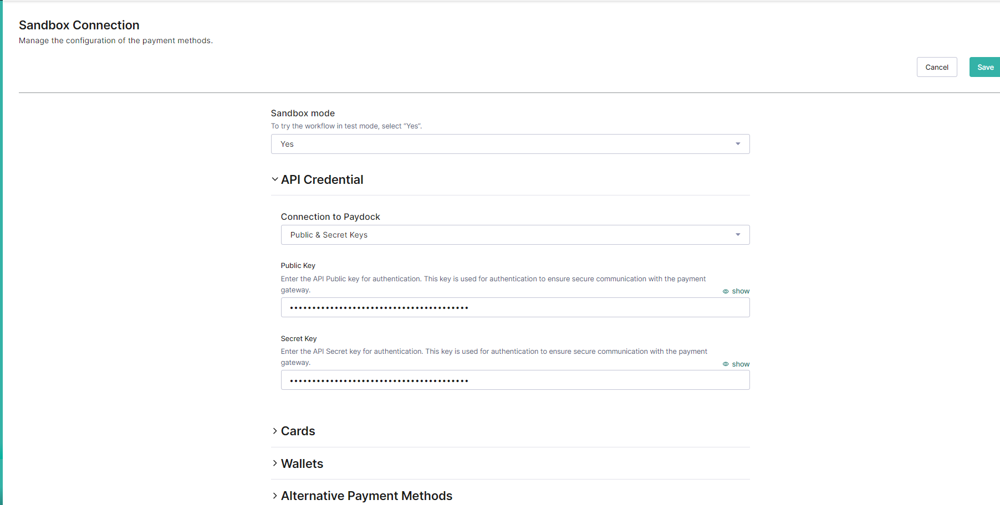

# Integration Guide

## Table of Contents

- [How It Works](#how-it-works)
    - [Add Notifications](#add-notifications)
    - [Processing Notifications](#processing-notifications)
- [Testing](#testing)
- [See Also](#see-also)
- [License](#license)

## How It Works
The Paydock system supports a variety of webhook events, which are automated messages triggered in response to specific activities such as updates, refunds, and manual captures. Supported events include:
- Transaction Success
- Transaction Failure
- Subscription Transactions (Success and Failure)
- Fraud Checks (Success and Failure)
- Refund Actions (Requested, Success, and Failure)
- And more...

## Add Notifications
Notifications can be added in two ways:
1. **Via Commercetools Paydock Custom Application:**
   Setting notifications via the [Commercetools Paydock Custom Application](https://github.com/PayDock/e-commerce-commercetools-app) automates the configuration within Paydock after you save the settings.
   

2. **Directly Through Paydock Account:**
   You can also manually add notifications by navigating to the notifications section in your [Paydock account](https://app.paydock.com/auth/sign-in).

## Processing Notifications
When actions related to charges occur in Paydock (e.g., status changes, refunds), our module receives a notification. For example:

```
{
                "event": "transaction_success",
                "notification": {
                    "id": "******",
                    "amount": 100,
                    "currency": "AUD",
                    "reference": "********",
                    "company_id": "*********",
                    "type": "financial",
                    "status": "complete",
                    "external_id": "*********",
                    "capture": true,
                    "authorization": false,
                    "one_off": true,
                    "created_at": "2024-06-06T14:54:02.229Z",
                    "updated_at": "2024-06-06T14:54:33.400Z",
                    "shipping": {
                        "address_line1": "****",
                        "address_country": "AU",
                        "address_city": "****",
                        "address_postcode": "***",
                        "contact": {
                            "first_name": "***",
                            "last_name": "***",
                            "phone": "+****"
                        }
                    },
                    "schedule": {
                        "stopped": false
                    },
                    "archived": false,
                    "_3ds": {},
                    "fraud": {},
                    "meta": {
                        "store_name": "Commercetools"
                    },
                    "customer": {
                        "last_name": "****",
                        "first_name": "***",
                        "email": "***@paydock.com",
                        "phone": "***",
                        "payment_source": {
                            "type": "wallet",
                            "wallet_type": "google",
                            "gateway_id": "*****",
                            "gateway_name": "TESTDEV_MERCHANT",
                            "gateway_type": "MasterCard",
                            "card_number_bin": "***",
                            "card_number_last4": "****",
                            "card_scheme": "VISA",
                            "address_line1": "****",
                            "address_city": "Mountain View",
                            "address_country": "US",
                            "address_state": "CA",
                            "address_postcode": "**",
                            "expire_month": 12,
                            "expire_year": *
                        }
                    },
                    "transactions": [
                        {
                            "id": "*****",
                            "external_id": "***a",
                            "external_reference": "**",
                            "amount": **,
                            "currency": "AUD",
                            "type": "sale",
                            "status": "complete",
                            "created_at": "2024-06-06T14:54:28.286Z",
                            "updated_at": "2024-06-06T14:54:33.383Z",
                            "include_authorization": false,
                            "status_code": "approved",
                            "_3ds": {},
                            "fraud": {}
                        }
                    ],
                    "transaction": {
                        "id": "***",
                        "external_id": "***",
                        "external_reference": "**",
                        "amount": ***,
                        "currency": "AUD",
                        "type": "sale",
                        "status": "complete",
                        "created_at": "2024-06-06T14:54:28.286Z",
                        "updated_at": "2024-06-06T14:54:33.383Z",
                        "include_authorization": false,
                        "status_code": "approved",
                        "_3ds": {},
                        "fraud": {}
                    }
                }
            }
        }
```
Our module then uses the ***refernce***  field to locate the corresponding payment in the commercetools system. If found, the payment information is updated accordingly.

## Test

To run tests, use the following command:

```
npm run test
```

## See also
- [Paydock Commercetools Custom Application](https://github.com/PayDock/e-commerce-commercetools-app/)
- [Paydock website](https://paydock.com/)

## License

This repository is available under the [MIT license](LICENSE).
